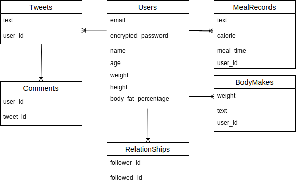

# アプリケーション名
Powers

# アプリケーション概要
毎日の体重の管理や食事内容の記録

そしてツイート機能やフォロー機能などで

同じ志を持った人たちとの交流や意見交換が出来ます。

# URL
http://35.76.86.211/

# テスト用アカウント
basic認証ID:admin

basic認証パスワード:2222

メールアドレス: test@test.com

パスワード: 222222

# 利用方法
トップページよりユーザー登録をする

ツイートや食事記録、体の記録を投稿できる

マイページからその日投稿した内容をカレンダーから確認出来る

# アプリケーションを作成した背景
僕自身がコンテストに出るために減量をしていた時に
アプリでの管理が必至だったのですが欲しい機能がひとまとめになっているアプリがなかったので作ろうと思いました。
ツイート機能に関しては同じ志を持った人と情報の共有や困ったことを相談できる場所が必要と感じていました。
体重管理や体の写真を投稿して後から見返すことも必要で日々の食事内容の記録も行わなければ減量が進まないのでそれらを踏まえての機能を搭載しました。

# 洗い出した要件
https://docs.google.com/spreadsheets/d/1kSLwH_n8XmVc293gYGt2uAQLAb_Dpf2GbxNyxlv_cv4/edit#gid=982722306

# DEMO
トップ画面にて簡単に記録を出来るようにしました。

・SNS機能をつけることによってダイエットが上手く時に色んな人の知識共有を得て現状を打破する手助け
※自分自身減量中に停滞して色んなことを試しても上手くいかない時にそういった情報で打破出来たので身をもって感じました

・体重や体の記録機能
毎日体重や自分の体を見ていても記録していなければぼんやりとした記憶になってしまうので
分かりやすくしっかりと記録できるようにしました

・食事内容の記録機能
これも上記と同じで何となく気をつけていても意外と沢山食べ過ぎてしまっていることがほとんどです
これも改善するために記録出来るようにしました。
そして人は記録するだけでも自制が出来るようになるので必須だと感じました

・カレンダーでの情報管理
マイページにてカレンダーからその日の情報を確認出来るようにしました

# 実装予定の機能
・ツイート機能においてユーザー全体の表示とフォローしている人のタイムラインを選択して閲覧できるようにします。

・マイページにおいてカレンダーに加え折れ線グラフを用いることで可視化しやすくします

# データベース設計

# 画面遷移図

# 開発環境
バックエンド：Ruby 2.6.0 / Ruby on Rails 6.0.0

フロントエンド：HTML.CSS

テキストエディタ：VScode

タスク管理：GitHub
# ローカルでの動以下のコマンドを順に実行。

% git clone https://github.com/xso2/Powers.git
% cd XXXXXX
% bundle install
% yarn install

# 工夫したポイント
大事にしている事が操作の簡素さです。
減量中は(特に減量末期)は何も考えたくないですし実際考えれませんので素晴らしい機能があっても操作が難しければ使う気になれません。
なので記録を簡単に行えることを第一に考えました。
